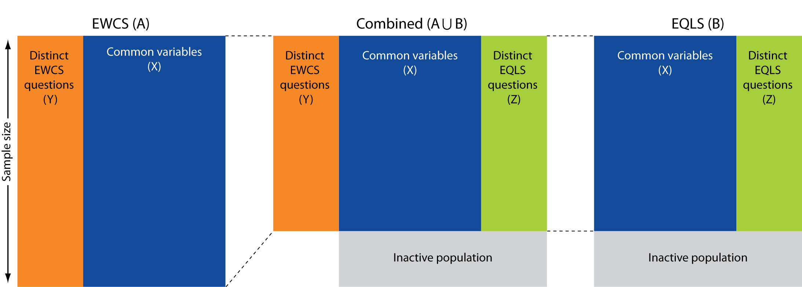

### Table of Contents

1. [Installation](#installation)
2. [Project Motivation](#motivation)
3. [File Descriptions](#files)
4. [Results](#results)
5. [Licensing, Authors, and Acknowledgements](#licensing)

## Installation 

Required R packages are documented in the RMD files.

## Project Motivation

This project combines two Eurofound surveys: the European Working Conditions Survey (EWCS) and European Quality of Life Survey (EQLS). The idea is that both surveys have a lot of variables in common so we can use those to impute variables from one survey into the other. These would be variables that live only in one of the surveys, not both. For this project, the focus was on work-life balance related variables and was a first attempt for Eurofound to use statistical matching and the goal was to create a combined synthetic micro datafile.

## File Descriptions 

There is a series of R markdown files

1. [**Identification_of_common_variables.Rmd**](http://htmlpreview.github.io/?https://github.com/mwilkens1/statmatch/blob/master/identification_of_common_variables.html) This is the first step that looks at which variables in both surveys could be considered as equal
2. [**Selection_of_the_matching_variables.Rmd**](http://htmlpreview.github.io/?https://github.com/mwilkens1/statmatch/blob/master/selection_of_the_matching_variables.html) Second step that checks which of the common variables are strong predictors of the variables of interest
3. [**Statistical_matching.Rmd**](http://htmlpreview.github.io/?https://github.com/mwilkens1/statmatch/blob/master/statistical_matching.html) Here the actual matching takes place.

## Results

report/working paper statistical matching.docx is the working paper that summarises all results.

## Licensing, Authors, Acknowledgements

Feel free to use the code. The data however, need to be downloaded from the UK data service: https://ukdataservice.ac.uk/

 
