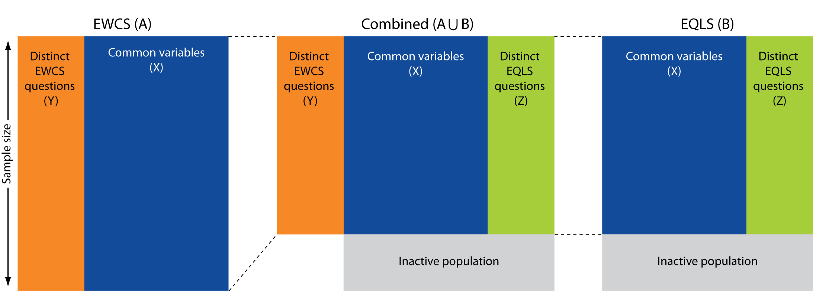

The aim of this step is to assess the variables X that are common to both datasets. Excel annex shows the first assessment on the basis of the questionnaires and here the similarty of the distributions of those variables will be checked. In some cases, recodes may be required. Also, this step removes the inactive respondents from the EQLS sample. 



# Preparation
```{r libaries, echo=TRUE, message=FALSE, warning=FALSE}
library(StatMatch)
library(survey)
library(ggplot2)
library(reshape2)
library(car)
library(knitr)
library(ggcorrplot)
```

```{r colours, message=FALSE, warning=FALSE}
source("Colours.R")
```

Datafiles created in 'import_data.R'
```{r}
load("EWCS_raw.Rda")
load("EQLS_raw.Rda")
```

# Harmonise population
Select working population based on EQLS definition. 
```{r harmonise population}
EQLS <- subset(EQLS_raw, employed==1)
EWCS <- subset(EWCS_raw, (y15_Q2c=="at work as employee or employer/self-employed* / relative assisting on family farm or business** " | 
                         y15_Q2c=="at work and on child-care leave or other leave                                                   " | 
                         y15_Q2c=="retired                                                                                          " ) &
                         y15_Q2b!="15" & y15_Q2b!="16" & y15_Q2b!="17")

#correcting one empty degurba
EQLS$Y16_Degurba[is.na(EQLS$Y16_Degurba)] <- "Large town"
```
This drops `r nrow(EQLS_raw)-nrow(EQLS)` cases in the EQLS because they are not employed. This also drops `r nrow(EWCS_raw)-nrow(EWCS)` cases in the EWCS. We will have to assume the weighting still applies. The mean of the weight is now `r mean(EWCS$w5_EU28)` so that seems reasonable.

It is important to consider that the weight no longer averages to 1 because the original weighting applies to the full sample and because the definition of the population has changed, so has the weight. For EQLS that shouldn't matter, because employement status was a poststratification variable. Neverthless there is a difference, which may be due to trimming of weights. 

Making sure country and urbanisation have the same labels and levels

```{r}
EWCS$country[EWCS$countid=="Austria"] <- 1
EWCS$country[EWCS$countid=="Belgium"] <- 2
EWCS$country[EWCS$countid=="Bulgaria"] <- 3
EWCS$country[EWCS$countid=="Croatia"] <- 4
EWCS$country[EWCS$countid=="Cyprus"] <- 5
EWCS$country[EWCS$countid=="Czech Republic"] <- 6
EWCS$country[EWCS$countid=="Denmark"] <- 7
EWCS$country[EWCS$countid=="Estonia"] <- 8
EWCS$country[EWCS$countid=="Finland"] <- 9
EWCS$country[EWCS$countid=="France"] <- 10
EWCS$country[EWCS$countid=="Germany"] <- 11
EWCS$country[EWCS$countid=="Greece"] <- 12
EWCS$country[EWCS$countid=="Hungary"] <- 13
EWCS$country[EWCS$countid=="Ireland"] <- 14
EWCS$country[EWCS$countid=="Italy"] <- 15
EWCS$country[EWCS$countid=="Latvia"] <- 16
EWCS$country[EWCS$countid=="Lithuania"] <- 17
EWCS$country[EWCS$countid=="Luxembourg"] <- 18
EWCS$country[EWCS$countid=="Malta"] <- 19
EWCS$country[EWCS$countid=="Netherlands"] <- 20
EWCS$country[EWCS$countid=="Poland"] <- 21
EWCS$country[EWCS$countid=="Portugal"] <- 22
EWCS$country[EWCS$countid=="Romania"] <- 23
EWCS$country[EWCS$countid=="Slovenia"] <- 24
EWCS$country[EWCS$countid=="Slovakia"] <- 25
EWCS$country[EWCS$countid=="Spain"] <- 26
EWCS$country[EWCS$countid=="Sweden"] <- 27
EWCS$country[EWCS$countid=="United Kingdom"] <- 28

EWCS$country <- factor(EWCS$country,levels=c(1:28),
                         labels=c("Austria","Belgium","Bulgaria","Croatia","Cyprus","Czech Republic","Denmark","Estonia","Finland","France","Germany","Greece","Hungary","Ireland","Italy","Latvia","Lithuania","Luxembourg","Malta","Netherlands","Poland","Portugal","Romania","Slovenia","Slovakia","Spain","Sweden","United Kingdom"),
                         ordered=F)


EQLS$country[EQLS$Y16_Country=="Austria"] <- 1
EQLS$country[EQLS$Y16_Country=="Belgium"] <- 2
EQLS$country[EQLS$Y16_Country=="Bulgaria"] <- 3
EQLS$country[EQLS$Y16_Country=="Croatia"] <- 4
EQLS$country[EQLS$Y16_Country=="Cyprus"] <- 5
EQLS$country[EQLS$Y16_Country=="Czech Republic"] <- 6
EQLS$country[EQLS$Y16_Country=="Denmark"] <- 7
EQLS$country[EQLS$Y16_Country=="Estonia"] <- 8
EQLS$country[EQLS$Y16_Country=="Finland"] <- 9
EQLS$country[EQLS$Y16_Country=="France"] <- 10
EQLS$country[EQLS$Y16_Country=="Germany"] <- 11
EQLS$country[EQLS$Y16_Country=="Greece"] <- 12
EQLS$country[EQLS$Y16_Country=="Hungary"] <- 13
EQLS$country[EQLS$Y16_Country=="Ireland"] <- 14
EQLS$country[EQLS$Y16_Country=="Italy"] <- 15
EQLS$country[EQLS$Y16_Country=="Latvia"] <- 16
EQLS$country[EQLS$Y16_Country=="Lithuania"] <- 17
EQLS$country[EQLS$Y16_Country=="Luxembourg"] <- 18
EQLS$country[EQLS$Y16_Country=="Malta"] <- 19
EQLS$country[EQLS$Y16_Country=="Netherlands"] <- 20
EQLS$country[EQLS$Y16_Country=="Poland"] <- 21
EQLS$country[EQLS$Y16_Country=="Portugal"] <- 22
EQLS$country[EQLS$Y16_Country=="Romania"] <- 23
EQLS$country[EQLS$Y16_Country=="Slovenia"] <- 24
EQLS$country[EQLS$Y16_Country=="Slovakia"] <- 25
EQLS$country[EQLS$Y16_Country=="Spain"] <- 26
EQLS$country[EQLS$Y16_Country=="Sweden"] <- 27
EQLS$country[EQLS$Y16_Country=="United Kingdom"] <- 28

EQLS$country <- factor(EQLS$country,levels=c(1:28),
                         labels=c("Austria","Belgium","Bulgaria","Croatia","Cyprus","Czech Republic","Denmark","Estonia","Finland","France","Germany","Greece","Hungary","Ireland","Italy","Latvia","Lithuania","Luxembourg","Malta","Netherlands","Poland","Portugal","Romania","Slovenia","Slovakia","Spain","Sweden","United Kingdom"),
                         ordered=F)


EQLS$urbanisation[EQLS$Y16_Degurba=="Large town"] <- 1
EQLS$urbanisation[EQLS$Y16_Degurba=="50001-200000"] <- 1
EQLS$urbanisation[EQLS$Y16_Degurba=="200001+"] <- 1
EQLS$urbanisation[EQLS$Y16_Degurba=="Small or middle sized town"] <- 2
EQLS$urbanisation[EQLS$Y16_Degurba=="10001 - 50000"] <- 2 
EQLS$urbanisation[EQLS$Y16_Degurba=="Rural area or village"] <- 3
EQLS$urbanisation[EQLS$Y16_Degurba=="<=10000"] <- 3 

EQLS$urbanisation <- factor(EQLS$urbanisation, levels=c(1:3), labels=c("Densely populated area","Intermediate area","Thinly populated area"),ordered=F)

EWCS$urbanisation[EWCS$EWCS_urbanisation1_3=="Urban"] <- 1
EWCS$urbanisation[EWCS$EWCS_urbanisation1_3=="Intermediate"] <- 2
EWCS$urbanisation[EWCS$EWCS_urbanisation1_3=="Rural"] <- 3

EWCS$urbanisation <- factor(EWCS$urbanisation, levels=c(1:3), labels=c("Densely populated area","Intermediate area","Thinly populated area"),ordered=F)

```

# Harmonise variables
The aim here is to check whether the same variables in the EWCS follow the same distribution in the EQLS. We can do this by

* Eyeballing the distribution 
* Calculating Hellinger's distance, which is a measure of dissimilarity of the distributions. A rule of thumb for Hellingers distance is that we can consider distributions to be equal if the value is below 0.05. Hellingers distance is based on frequency tables which for the purposes of this excersise have been weighted. This is not robust at all, because if sample sizes are smaller, distributions are more likely to diverge as a result of statistical uncertainty. This is evident when looking at Hellingers distance by country. 
* Statistical tests between distributions, e.g. a t-test for continuous variables are difficult because we need to take into account the variance due to clustering. One option is to divide the Chi-square test by the generalised design effect of both surveys. The 'Delta H0' shows the value of the generalised design effect that would determine the acceptance of the null hypothesis (equality of distributions) in the case of alpha=0.05 (df=J-1). In other words: the minimum design effect we would have to assume in order to conclude the disributions are the same.  

My impression is that deciding on whether two variables from two surveys can be considered coherent is largely a subjective choice in the end. Subjective in the sense that there are no conclusive statistical tests. To interpret the Chi square we need to know something about the design effect for each variable. This is difficult to calculate now because we would need to reweigh both datasets to the new definition of the population. Also, if we would have the design effect we are more likely to conclude the distributions are not dissimilar if we have a higher sample size and/or a smaller design effect. I am not sure if that is a sensible way of assessing this. What makes more sense to me is setting a threshold of a certain degree of dissimilarity, i.e. the differences between the distributions within that threshold would be considered acceptable. Of course the level of the threshold itself is also arbitrary, but at least this is a systematic way of looking at it. Eurostat (2013) mentions a threshold of 0.05 for Hellingers distance which I will apply here as well. There are exceptions to this measure: Hellingers distance cannot be calculated for continuous variables and if categories have many variables Hellingers distance becomes less effective. 

```{r functions, echo=TRUE}
#Function for svydesign
define_svy <- function(data_EWCS=EWCS,data_EQLS=EQLS) {
  
  EWCS_svyd <<- svydesign(id=~EWCS_samplepoint, strata=~countid+EWCS_region+EWCS_sizeoflocality, weights=~w5_EU28, data=data_EWCS)  
  EQLS_svyd <<- svydesign(~Y16_Samplingpoint,strata=~Y16_Country+Y16_Region+Y16_Degurba,weights=~WCalib_crossnational_EU28,data=data_EQLS)

}

#Function for Hellingers distance
Helld <- function(x,y,data_EWCS=EWCS,data_EQLS=EQLS) {
  
            define_svy(data_EWCS,data_EQLS)
  
            comp.prop(
            svytable(x, EQLS_svyd),
            svytable(y, EWCS_svyd),
            sum(svytable(x, EQLS_svyd)),
            sum(svytable(y, EWCS_svyd)))
      }

#Function for plot with Hellingers distance
HD <- function(x,y,name="variable") {

  define_svy()
  
  h <- Helld(x,y)
  
  t_EQLS <- prop.table(svytable(x, EQLS_svyd))
  t_EQLS <- melt(t_EQLS)
  t_EQLS$Data <- "EQLS"
  colnames(t_EQLS)[1] <- name
  t_EWCS <- prop.table(svytable(y, EWCS_svyd))
  t_EWCS <- melt(t_EWCS)
  colnames(t_EWCS)[1] <- name
  t_EWCS$Data <- "EWCS"
  df <- rbind(t_EQLS,t_EWCS)
  
  p <- ggplot(df, aes_string(x=name,y="value",fill="Data"))
 print(p + geom_bar(stat="identity", position="dodge") + 
          scale_fill_manual(values=EF_2c2, name=paste("\n\nHellinger's \ndistance:\n\n",
                                                      round(h$meas[4],3),
                                                      "\n\nDelta H0:\n\n",
                                                      round(h$chi.sq[4],3)
                                                      )) +
          guides(fill = guide_legend(title.position = "bottom")) +
          theme_minimal() +
          theme(axis.title.y=element_blank()))
}  


#Function for plot with hellingers distance by country
Helld_country <- function(x,y) {
  
  s <- as.data.frame(
          sapply(
            levels(EWCS$country),
            FUN=function(x,y,z) {EWCS <- subset(EWCS, country==z)
                                 EQLS <- subset(EQLS, country==z)
                                 h <- Helld(x,y,data_EWCS=EWCS,data_EQLS=EQLS)
                                 h$meas[4]},
            x=x,y=y,simplify = F
                )
                    )
  s <- melt(s,value.name="HD",variable.name="Country", id.vars=NULL)

  ggplot(s,aes(x=Country,y=HD)) + 
    geom_bar(stat="identity",fill=EF_blue) + 
    coord_flip() +
    scale_x_discrete(limits = rev(levels(s$Country))) +
    scale_y_continuous(expand = c(0, 0)) +
    geom_hline(yintercept=0.05) +
    ylab("Hellinger's distance") +
    theme_minimal() +
    theme(panel.grid.major.y = element_blank(),
          axis.title.y = element_blank())
}

```

### Gender
Variable name: Gender

**Conclusion: same distribution**

```{r}
levels(EWCS$y15_Q2a) <- c("Male","Female")

HD(~Y16_HH2a,~y15_Q2a,name="Gender")

Helld_country(~Y16_HH2a,~y15_Q2a)

EQLS$Gender <- EQLS$Y16_HH2a
EWCS$Gender <- EWCS$y15_Q2a
```

### Age
Variables:
agenum is the continuous variable, and
agecat_5 is that split up in five categories. 

**Conclusion: same distribution for EU28, but not in each country**

```{r}
EWCS$agenum <- as.numeric(levels(EWCS$y15_Q2b))[EWCS$y15_Q2b]
EQLS$agenum <- EQLS$Y16_HH2b 

EQLS$agecat_5 <- recode(EQLS$Y16_HH2b,"lo:24='under 25';25:34='25-34';35:44='35-44';45:54=' 45-54';55:hi='55+'",as.factor.result=TRUE,
                        levels = c('under 25','25-34','35-44',' 45-54','55+'))

HD(~agecat_5,~agecat_5,name="agecat_5")
Helld_country(~agecat_5,~agecat_5)
```

```{r}
ggplot() +
  geom_density(data=EWCS, aes(x=agenum), colour=EF_orange, na.rm=T) +
  geom_density(data=EQLS, aes(x=agenum), colour=EF_green, na.rm=T) +
  theme_minimal()
```
Note: unweighted

But also looking at the distribution of the continuous variable we can conclude that the distribution is very similar. 

### Employment status
variable name: empl_stat

**Conclusion: same distribution for EU28, but not in each country**

```{r}
levels(EWCS$y15_Q7) <- trimws(levels(EWCS$y15_Q7), which="both")
EWCS$selfemployed <- EWCS$y15_Q7
EQLS$selfemployed <- EWCS$y15_Q9

EQLS$empl_stat[EQLS$Y16_Q9=="Self-employed"] <- 0
EQLS$empl_stat[EQLS$Y16_Q10=="An unlimited permanent contract"] <- 1
EQLS$empl_stat[EQLS$Y16_Q10=="A fixed term contract of less than 12 months"] <- 2
EQLS$empl_stat[EQLS$Y16_Q10=="A fixed term contract of 12 months or more"] <- 2
EQLS$empl_stat[EQLS$Y16_Q10=="A temporary employment agency contract"] <- 3
EQLS$empl_stat[EQLS$Y16_Q10=="An apprenticeship or other training scheme"] <- 3
EQLS$empl_stat[EQLS$Y16_Q10=="No written contract"] <- 3
EQLS$empl_stat[EQLS$Y16_Q10=="Other"] <- 3

EWCS$empl_stat[EWCS$emp_stat=="self-employed with employees"] <- 0
EWCS$empl_stat[EWCS$emp_stat=="self-employed without employees"] <- 0
EWCS$empl_stat[EWCS$emp_stat=="employee, indefinite contract"] <- 1
EWCS$empl_stat[EWCS$emp_stat=="employee, fixed term contract"] <- 2
EWCS$empl_stat[EWCS$emp_stat=="employee, other or no contract"] <- 3

EQLS$empl_stat <- factor(EQLS$empl_stat,levels=c(0:3),
                         labels=c("Self-employed","Employee, indefinite contract","Employee, fixed term contract","Employee, other or no contract"),
                         ordered=F)
EWCS$empl_stat <- factor(EWCS$empl_stat,levels=c(0:3),
                         labels=c("Self-employed","Employee, indefinite contract","Employee, fixed term contract","Employee, other or no contract"),
                         ordered=F)

HD(~empl_stat,~empl_stat,name="empl_stat")
Helld_country(~empl_stat,~empl_stat)

```

Simlified version of employment status 
```{r}
EWCS$empl_stat2[EWCS$empl_stat=="Self-employed"] <- 1
EWCS$empl_stat2[EWCS$empl_stat=="Employee, indefinite contract"] <- 2
EWCS$empl_stat2[EWCS$empl_stat=="Employee, fixed term contract"] <- 2
EWCS$empl_stat2[EWCS$empl_stat=="Employee, other or no contract"] <- 2
EWCS$empl_stat2 <- factor(EWCS$empl_stat2, levels=c(1:2), labels=c("Self-employed","employee"))

EQLS$empl_stat2[EQLS$empl_stat=="Self-employed"] <- 1
EQLS$empl_stat2[EQLS$empl_stat=="Employee, indefinite contract"] <- 2
EQLS$empl_stat2[EQLS$empl_stat=="Employee, fixed term contract"] <- 2
EQLS$empl_stat2[EQLS$empl_stat=="Employee, other or no contract"] <- 2
EQLS$empl_stat2 <- factor(EQLS$empl_stat2, levels=c(1:2), labels=c("Self-employed","employee"))

HD(~empl_stat2,~empl_stat2,name="empl_stat2")
Helld_country(~empl_stat2,~empl_stat2)

```


### Working time 
variable name: 
hours_mainjob
totalhour

**Conclusion: distributions are similar but not the same. We could consider rank hot deck for this variable, assuming that the rank, but not the level is the same between the surveys**

```{r}
EQLS$hours_mainjob <- as.numeric(levels(EQLS$Y16_Q14))[EQLS$Y16_Q14]
EWCS$hours_mainjob <- as.numeric(levels(EWCS$y15_Q24))[EWCS$y15_Q24]

EQLS$jobhour <- recode(EQLS$hours_mainjob,"lo:20='20 or less';21:34='21-34';35:40='35-40';41:47='41-47';48:hi='48 or more'",as.factor.result=TRUE,
                        levels = c('20 or less','21-34','35-40','41-47','48 or more'))

HD(~jobhour,~jobhour,name="jobhour")
Helld_country(~jobhour,~jobhour)

EQLS$hours_secjob <- as.numeric(levels(EQLS$Y16_Q16))[EQLS$Y16_Q16]
EQLS$hours_secjob[is.na(EQLS$Y16_Q16)] <- 0
EQLS$totalhour <- EQLS$hours_secjob + as.numeric(levels(EQLS$Y16_Q14))[EQLS$Y16_Q14]

ggplot() +
  geom_density(data=EWCS, aes(x=totalhour), colour=EF_orange, na.rm=T) +
  geom_density(data=EQLS, aes(x=totalhour), colour=EF_green, na.rm=T) +
  theme_minimal()

EQLS$totalhour_cat <- recode(EQLS$totalhour,"lo:20='20 or less';21:34='21-34';35:40='35-40';41:47='41-47';48:hi='48 or more'",as.factor.result=TRUE,
                       levels = c('20 or less','21-34','35-40','41-47','48 or more'))

EWCS$totalhour_cat <- recode(EWCS$totalhour,"lo:20='20 or less';21:34='21-34';35:40='35-40';41:47='41-47';48:hi='48 or more'",as.factor.result=TRUE,
                       levels = c('20 or less','21-34','35-40','41-47','48 or more'))

HD(~totalhour_cat,~totalhour_cat,name="totalhour_cat")
Helld_country(~totalhour_cat,~totalhour_cat)

```

Jobhour is Q24 in EWCS (How many hours do you usually work per week in your main paid job?) and Q14 in EQLS (How many hours do you normally work per week in your main job, including any paid or unpaid overtime?)

The difference in the distributon might be the result of the explicit mentioning of paid or unpaid overtime in the EQLS. Mean of working hours in the EQLS is also 1.5 hours higher than in the EWCS.

```{r}
ggplot() +
  geom_density(data=EWCS, aes(x=hours_mainjob), colour=EF_orange, na.rm=T) +
  geom_density(data=EQLS, aes(x=hours_mainjob), colour=EF_green, na.rm=T) +
  theme_minimal()
```

Distribution of continuous variable shows similar pattern. 

### Preferred hours
variable: 
hours_pref (continuous)
hours_pref_cat (categorical)

**Conclusion: for the purposes of statistical matching also here we could consider rank hot deck. Proceed with caution.**

```{r}
EQLS$Q17 <- as.numeric(levels(EQLS$Y16_Q17))[EQLS$Y16_Q17]
EWCS$hours_pref  <- droplevels(EWCS$y15_Q25)
EWCS$y15_Q25 <- as.numeric(levels(EWCS$hours_pref ))[EWCS$hours_pref]

EQLS$hours_pref <- EQLS$Q17
EWCS$hours_pref <- EWCS$y15_Q25

ggplot() +
  geom_density(data=EWCS, aes(x=hours_pref), colour=EF_orange, na.rm=T) +
  geom_density(data=EQLS, aes(x=hours_pref), colour=EF_green, na.rm=T) +
  theme_minimal()

EQLS$hours_pref_cat <- recode(EQLS$hours_pref,"lo:20='20 or less';21:34='21-34';35:40='35-40';41:47='41-47';48:hi='48 or more'",as.factor.result=TRUE,
                       levels = c('20 or less','21-34','35-40','41-47','48 or more'))
EWCS$hours_pref_cat <- recode(EWCS$hours_pref,"lo:20='20 or less';21:34='21-34';35:40='35-40';41:47='41-47';48:hi='48 or more'",as.factor.result=TRUE,
                       levels = c('20 or less','21-34','35-40','41-47','48 or more'))

HD(~hours_pref_cat,~hours_pref_cat,name="hours_pref_cat")  
Helld_country(~hours_pref_cat,~hours_pref_cat)  

```

EQLS respondents prefer to work fewer hours than EWCS respondents. Possible explanations: 

* selection: the EQLS has respondents that work more hours so therefore it is more likely they will want to reduce their hours further
* non-response bias: those respondents that do the EQLS may be triggered by the topic of quality of life, while those respondents that do the EWCS might be more triggered by the topic of work and therefore are more likely to be people that would like to work more. 
* EQLS question on preferred working hours asks for ‘the number of your working hours’ and it is not clear if this is interpreted as including or excluding overtime. It is not explicitly mentioned so it is not completely consistent. This may explain their tendency to prefer a lower number of hours. 
  
### Preferred hours: more, the same or less. 
variable: prefhour

**Conclusion: not similar**

```{r}
EQLS$prefhour[EQLS$Q17<EQLS$totalhour] <- 0
EQLS$prefhour[EQLS$Q17==EQLS$totalhour] <- 1
EQLS$prefhour[EQLS$Q17>EQLS$totalhour] <- 2

EQLS$prefhour <- factor(EQLS$prefhour,levels=c(0,1,2),labels=c("less than currently","same as currently","more than currently"),ordered=F)

HD(~prefhour,~prefhour,name="prefhour")
Helld_country(~prefhour,~prefhour)

```

Strong differences between the EWCS and EQLS: this is the result of the combination of findings mentioned above

### ISCO1
Variable: ISCO

**Conclusion: similar distribution. Hellingers distance is on the large side, but the number of categories is also large.**

Following level 1 of the [ISCO 08 classification](http://www.ilo.org/public/english/bureau/stat/isco/docs/structure08.docx) and added the distinction between service and sales workers because that is also done in the EQLS. 

```{r}
EQLS$ISCO[EQLS$Y16_Q11=="Armed forces occupation"] <- 10
EQLS$ISCO[EQLS$Y16_Q11=="Manager"] <- 1
EQLS$ISCO[EQLS$Y16_Q11=="Professional"] <- 2
EQLS$ISCO[EQLS$Y16_Q11=="Technician or junior professional"] <- 3 
EQLS$ISCO[EQLS$Y16_Q11=="Clerical support worker"] <- 4 
EQLS$ISCO[EQLS$Y16_Q11=="Service worker"] <- 5
EQLS$ISCO[EQLS$Y16_Q11=="Sales worker"] <- 6 
EQLS$ISCO[EQLS$Y16_Q11=="Skilled agricultural forestry and fishery worker"] <- 7 
EQLS$ISCO[EQLS$Y16_Q11=="Craft and related trades worker"] <- 8
EQLS$ISCO[EQLS$Y16_Q11=="Plant and machine operator or assembler"] <- 9 
EQLS$ISCO[EQLS$Y16_Q11=="Elementary occupations" ] <- 10

EWCS$ISCO[EWCS$y15_isco_08_1=="Armed forces occupations"] <- 10
EWCS$ISCO[EWCS$y15_isco_08_1=="Managers"] <- 1
EWCS$ISCO[EWCS$y15_isco_08_1=="Professionals"] <- 2
EWCS$ISCO[EWCS$y15_isco_08_1=="Technicians and associate professionals"] <- 3
EWCS$ISCO[EWCS$y15_isco_08_1=="Clerical support workers"] <- 4
EWCS$ISCO[EWCS$y15_isco_08_2=="Personal service workers" | EWCS$y15_isco_08_2=="Personal care workers" | EWCS$y15_isco_08_2=="Protective services workers"] <- 5
EWCS$ISCO[EWCS$y15_isco_08_2=="Sales workers"] <- 6
EWCS$ISCO[EWCS$y15_isco_08_1=="Skilled agricultural, forestry and fishery workers"] <- 7
EWCS$ISCO[EWCS$y15_isco_08_1=="Craft and related trades workers"] <- 8
EWCS$ISCO[EWCS$y15_isco_08_1=="Plant and machine operators, and assemblers"] <- 9
EWCS$ISCO[EWCS$y15_isco_08_1=="Elementary occupations"] <- 10

EQLS$ISCO <- factor(EQLS$ISCO,
                    levels=c(1:10),
                    labels=c("Managers",
                             "Professionals",
                             "Technicians and associate professionals",
                             "Clerical support workers",
                             "Service workers",
                             "Sales workers",
                             "Skilled agricultural, forestry and fishery workers",
                             "Craft and related trades workers",
                             "Plant and machine operators and assemblers",
                             "Elementary occupations"),
                    ordered=F)

EWCS$ISCO <- factor(EWCS$ISCO,
                    levels=c(1:10),
                    labels=c("Managers",
                             "Professionals",
                             "Technicians and associate professionals",
                             "Clerical support workers",
                             "Service workers",
                             "Sales workers",
                             "Skilled agricultural, forestry and fishery workers",
                             "Craft and related trades workers",
                             "Plant and machine operators and assemblers",
                             "Elementary occupations"),
                    ordered=F)

HD(~ISCO,~ISCO,name="ISCO")
Helld_country(~ISCO,~ISCO)
```

Similarity in distribution is overall not bad given the amount of categories, but EQLS seems to have more service workers and EWCS more professionals. 

Simplified version of ISCO
```{r}
EWCS$ISCOv2[EWCS$ISCO=="Managers"] <- 1
EWCS$ISCOv2[EWCS$ISCO=="Professionals"] <- 1
EWCS$ISCOv2[EWCS$ISCO=="Technicians and associate professionals" ] <- 2
EWCS$ISCOv2[EWCS$ISCO=="Clerical support workers" ] <- 2
EWCS$ISCOv2[EWCS$ISCO=="Service workers" ] <- 2
EWCS$ISCOv2[EWCS$ISCO=="Sales workers" ] <- 2
EWCS$ISCOv2[EWCS$ISCO=="Skilled agricultural, forestry and fishery workers" ] <- 3
EWCS$ISCOv2[EWCS$ISCO=="Craft and related trades workers"] <- 3
EWCS$ISCOv2[EWCS$ISCO=="Plant and machine operators and assemblers"] <- 4
EWCS$ISCOv2[EWCS$ISCO=="Elementary occupations"] <- 4
EWCS$ISCOv2[EWCS$y15_isco_08_1=="Armed forces occupations"] <- 4
EWCS$ISCOv2 <- factor(EWCS$ISCOv2, levels=c(1:4), labels=c("High-skilled clerical","Low-skilled clerical","High-skilled manual","Low-skilled manual"))

EQLS$ISCOv2[EQLS$ISCO=="Managers"] <- 1
EQLS$ISCOv2[EQLS$ISCO=="Professionals"] <- 1
EQLS$ISCOv2[EQLS$ISCO=="Technicians and associate professionals" ] <- 2
EQLS$ISCOv2[EQLS$ISCO=="Clerical support workers" ] <- 2
EQLS$ISCOv2[EQLS$ISCO=="Service workers" ] <- 2
EQLS$ISCOv2[EQLS$ISCO=="Sales workers" ] <- 2
EQLS$ISCOv2[EQLS$ISCO=="Skilled agricultural, forestry and fishery workers" ] <- 3
EQLS$ISCOv2[EQLS$ISCO=="Craft and related trades workers"] <- 3
EQLS$ISCOv2[EQLS$ISCO=="Plant and machine operators and assemblers"] <- 4
EQLS$ISCOv2[EQLS$ISCO=="Elementary occupations"] <- 4
EQLS$ISCOv2[EQLS$Y16_Q11=="Armed forces occupation"] <- 4
EQLS$ISCOv2 <- factor(EQLS$ISCOv2, levels=c(1:4), labels=c("High-skilled clerical","Low-skilled clerical","High-skilled manual","Low-skilled manual"))

HD(~ISCOv2,~ISCOv2,name="ISCOv2")
Helld_country(~ISCOv2,~ISCOv2)
```


###Partner
Variable: partner

**Conclusion: same distribution for EU28, but differences at country level**

```{r}
EQLS$partner <- EQLS$haspartner

HD(~partner,~partner,name="partner")
Helld_country(~partner,~partner)
```

###Children
variable: num_children

**Conclusion: the same distribution**

Note: havent plotted it by country, because this is difficult to program. Thats because the max number of children is not the same in each country.

```{r}
EWCS$num_children <- apply(EWCS[,c("y15_Q3c_2","y15_Q3c_3","y15_Q3c_4","y15_Q3c_5","y15_Q3c_6","y15_Q3c_7","y15_Q3c_8","y15_Q3c_9","y15_Q3c_10")], 
                        1, 
                        function(x) length(which(x=="Child: Son/daughter of respondent or cohabiting partner" |
                                                 x=="Daughter or son-in-law                                 " |
                                                 x=="Grand child                                            " )
                                           )
                        )

EQLS$num_children <- apply(EQLS[,c("Y16_HH3c_2","Y16_HH3c_3","Y16_HH3c_4","Y16_HH3c_5","Y16_HH3c_6","Y16_HH3c_7","Y16_HH3c_8","Y16_HH3c_9","Y16_HH3c_10")], 
                        1, 
                        function(x) length(which(x=="Your son/daughter" |
                                                 x=="Your stepchild (only separated in 4th EQLS)" |
                                                 x=="Your daughter-in-law or son-in-law" |
                                                 x=="Your grandchild")
                                           )
                        )


HD(~num_children,~num_children,name="num_children")

```

Simplified version of having children
```{r}
EWCS$child_in_hh[EWCS$num_children>0]  <- 1
EWCS$child_in_hh[EWCS$num_children==0] <- 0
  
EQLS$child_in_hh[EQLS$num_children>0]  <- 1
EQLS$child_in_hh[EQLS$num_children==0] <- 0

EWCS$child_in_hh <- factor(EWCS$child_in_hh, levels = c(0,1), labels = c("No children", "One or more children"))
EQLS$child_in_hh <- factor(EQLS$child_in_hh, levels = c(0,1), labels = c("No children", "One or more children"))

HD(~child_in_hh,~child_in_hh,name = "child_in_hh")
Helld_country(~child_in_hh,~child_in_hh)
```

### Partner / Child interaction
Variable: partner_child

**Conclusion: also the joint distributions of partner and children are very similar on EU28 level. Less so on country level**

```{r}

EQLS$partner_child[EQLS$partner==0 & EQLS$num_children==0] <- 0
EQLS$partner_child[EQLS$partner==1 & EQLS$num_children==0] <- 1
EQLS$partner_child[EQLS$partner==0 & EQLS$num_children> 0] <- 2
EQLS$partner_child[EQLS$partner==1 & EQLS$num_children> 0] <- 3

EWCS$partner_child[EWCS$partner==0 & EWCS$num_children==0] <- 0
EWCS$partner_child[EWCS$partner==1 & EWCS$num_children==0] <- 1
EWCS$partner_child[EWCS$partner==0 & EWCS$num_children> 0] <- 2
EWCS$partner_child[EWCS$partner==1 & EWCS$num_children> 0] <- 3

EQLS$partner_child <- factor(EQLS$partner_child,levels=c(0:3),labels=c("Single, no children","Couple, no children","Single parent","Couple with children"),ordered=F)
EWCS$partner_child <- factor(EWCS$partner_child,levels=c(0:3),labels=c("Single, no children","Couple, no children","Single parent","Couple with children"),ordered=F)

HD(~partner_child,~partner_child,name = "partner_child")
Helld_country(~partner_child,~partner_child)

```

### Household size
Variable: hh_size

**Conclusion: similar distribution, but not in all countries**

```{r}

EQLS$hh_size[EQLS$Y16_HH1==1] <- 1
EQLS$hh_size[EQLS$Y16_HH1==2] <- 2
EQLS$hh_size[EQLS$Y16_HH1==3] <- 3
EQLS$hh_size[EQLS$Y16_HH1==4] <- 4
EQLS$hh_size[EQLS$Y16_HH1==5] <- 5
EQLS$hh_size[EQLS$Y16_HH1>=6] <- 6

EWCS$hh_size[EWCS$y15_Q1=="1"] <- 1
EWCS$hh_size[EWCS$y15_Q1=="2"] <- 2
EWCS$hh_size[EWCS$y15_Q1=="3"] <- 3
EWCS$hh_size[EWCS$y15_Q1=="4"] <- 4
EWCS$hh_size[EWCS$y15_Q1=="5"] <- 5
EWCS$hh_size[EWCS$y15_Q1=="6 or more"] <- 6

EQLS$hh_size <- factor(EQLS$hh_size,levels=c(1:6),labels=c("1","2","3","4","5","6 or more"),ordered=T)
EWCS$hh_size <- factor(EWCS$hh_size,levels=c(1:6),labels=c("1","2","3","4","5","6 or more"),ordered=T)

HD(~hh_size,~hh_size,name="hh_size")
Helld_country(~hh_size,~hh_size)
```

### Working hours of the partner
Variable: 
partner_hour (continuous)
partner_hour_cat (categorical)

Note: this is missing for those without a partner

**Conclusion: similar distribution, with country differences**

```{r}

EWCS$partner_hour <- as.numeric(levels(EWCS$y15_Q97))[EWCS$y15_Q97]
EQLS$partner_hour <- as.numeric(levels(EQLS$Y16_Q18))[EQLS$Y16_Q18]

ggplot() +
  geom_density(data=EWCS, aes(x=partner_hour), colour=EF_orange, na.rm=T) +
  geom_density(data=EQLS, aes(x=partner_hour), colour=EF_green, na.rm=T) +
  theme_minimal()

EQLS$partner_hour_cat <- recode(EQLS$partner_hour,"lo:20='20 or less';21:34='21-34';35:40='35-40';41:47='41-47';48:hi='48 or more'",as.factor.result=TRUE,
                                                  levels = c('20 or less','21-34','35-40','41-47','48 or more'))
EWCS$partner_hour_cat <- recode(EWCS$partner_hour,"lo:20='20 or less';21:34='21-34';35:40='35-40';41:47='41-47';48:hi='48 or more'",as.factor.result=TRUE,
                                                  levels = c('20 or less','21-34','35-40','41-47','48 or more'))

HD(~partner_hour_cat, ~partner_hour_cat, name="partner_hour_cat")
Helld_country(~partner_hour_cat,~partner_hour_cat)

```

### General health
Variable
gen_health

**Conclusion: same distribution with country differences**

```{r}

EQLS$gen_health[EQLS$Y16_Q48=="Very bad    "] <- 0
EQLS$gen_health[EQLS$Y16_Q48=="Bad         "] <- 1
EQLS$gen_health[EQLS$Y16_Q48=="Fair        "] <- 2
EQLS$gen_health[EQLS$Y16_Q48=="Good        "] <- 3
EQLS$gen_health[EQLS$Y16_Q48=="Very good   "] <- 4

EWCS$gen_health[EWCS$y15_Q75=="Very bad                    "] <- 0
EWCS$gen_health[EWCS$y15_Q75=="Bad                         "] <- 1
EWCS$gen_health[EWCS$y15_Q75=="Fair                        "] <- 2
EWCS$gen_health[EWCS$y15_Q75=="Good                        "] <- 3
EWCS$gen_health[EWCS$y15_Q75=="Very good                   "] <- 4

EWCS$gen_health <- factor(EWCS$gen_health,levels=c(0:4),labels=c("Very bad","Bad","Fair","Good","Very good"),ordered=T)
EQLS$gen_health <- factor(EQLS$gen_health,levels=c(0:4),labels=c("Very bad","Bad","Fair","Good","Very good"),ordered=T)

HD(~gen_health,~gen_health,name="gen_health")
Helld_country(~gen_health,~gen_health)

```

### WHO5
variable
who5 (continuous)

**Conclusion: very similar distribution**

```{r}
EQLS$who5 <- EQLS$Y16_WHO5_MWIndex
EWCS$who5 <- EWCS$wellbeing

ggplot() +
  geom_density(data=EWCS, aes(x=who5), colour=EF_orange, na.rm=T) +
  geom_density(data=EQLS, aes(x=who5), colour=EF_green, na.rm=T) +
  theme_minimal()

EQLS$who5_cat[EQLS$who5<20] <- 0
EQLS$who5_cat[EQLS$who5>20 & EQLS$who5<40] <- 1
EQLS$who5_cat[EQLS$who5>40 & EQLS$who5<60] <- 2
EQLS$who5_cat[EQLS$who5>60 & EQLS$who5<80] <- 3
EQLS$who5_cat[EQLS$who5>80] <- 4

EWCS$who5_cat[EWCS$who5<20] <- 0
EWCS$who5_cat[EWCS$who5>20 & EWCS$who5<40] <- 1
EWCS$who5_cat[EWCS$who5>40 & EWCS$who5<60] <- 2
EWCS$who5_cat[EWCS$who5>60 & EWCS$who5<80] <- 3
EWCS$who5_cat[EWCS$who5>80] <- 4

HD(~who5_cat,~who5_cat,name="who5_cat")
Helld_country(~who5_cat,~who5_cat)

```

### Commuting time
Variable
commute_time (continuous)

**Conclusion: very similar distribution**

```{r}
EWCS$commute_time <- EWCS$y15_Q36
EWCS$commute_time <- as.numeric(levels(EWCS$commute_time))[EWCS$commute_time]
EWCS$commute_time[is.na(EWCS$commute_time)] <- 0

EQLS$commute_time <- EQLS$Y16_Q57
EQLS$commute_time <- as.numeric(levels(EQLS$commute_time))[EQLS$commute_time]

ggplot() +
  geom_density(data=EWCS, aes(x=commute_time), colour=EF_orange, na.rm=T) +
  geom_density(data=EQLS, aes(x=commute_time), colour=EF_green, na.rm=T) +
  theme_minimal()

```

###Education
variable:
education_3cat

Note: this variable would also be available with more categories, but some categories are quite small

**Conclusion: same distribution**

Very big difference in Austria for some reason

```{r}

EQLS$education_3cat[EQLS$education_traditional_3cat=="Primary"]   <- 1
EQLS$education_3cat[EQLS$education_traditional_3cat=="Secondary"] <- 2
EQLS$education_3cat[EQLS$education_traditional_3cat=="Tertiary"]  <- 3

EWCS$education_3cat[EWCS$education=="primary"]   <- 1
EWCS$education_3cat[EWCS$education=="secondary"] <- 2
EWCS$education_3cat[EWCS$education=="tertiary"]  <- 3

EWCS$education_3cat <- factor(EWCS$education_3cat,levels=c(1:3),labels=c("Primary","Secondary","Tertiary"),ordered=T)
EQLS$education_3cat <- factor(EQLS$education_3cat,levels=c(1:3),labels=c("Primary","Secondary","Tertiary"),ordered=T)

HD(~education_3cat,~education_3cat,name="education_3cat")
Helld_country(~education_3cat,~education_3cat)
```

### Making ends meet
Variable: 
make_ends_meet

**Conclusion: same distribution, with country differences**

```{r}

EQLS$make_ends_meet[EQLS$Y16_Q88=="With great difficulty"] <- 0
EQLS$make_ends_meet[EQLS$Y16_Q88=="With difficulty      "] <- 1
EQLS$make_ends_meet[EQLS$Y16_Q88=="With some difficulty "] <- 2
EQLS$make_ends_meet[EQLS$Y16_Q88=="Fairly easily        "] <- 3
EQLS$make_ends_meet[EQLS$Y16_Q88=="Easily               "] <- 4
EQLS$make_ends_meet[EQLS$Y16_Q88=="Very easily          "] <- 5

EWCS$make_ends_meet[EWCS$y15_Q100=="With great difficulty       "] <- 0
EWCS$make_ends_meet[EWCS$y15_Q100=="With difficulty             "] <- 1
EWCS$make_ends_meet[EWCS$y15_Q100=="With some difficulty        "] <- 2
EWCS$make_ends_meet[EWCS$y15_Q100=="Fairly easily               "] <- 3
EWCS$make_ends_meet[EWCS$y15_Q100=="Easily                      "] <- 4
EWCS$make_ends_meet[EWCS$y15_Q100=="Very easily                 "] <- 5

EWCS$make_ends_meet <- factor(EWCS$make_ends_meet,levels=c(0:5),labels=c("With great difficulty","With difficulty","With some difficulty","Fairly easily","Easily","Very easily"),ordered=T)
EQLS$make_ends_meet <- factor(EQLS$make_ends_meet,levels=c(0:5),labels=c("With great difficulty","With difficulty","With some difficulty","Fairly easily","Easily","Very easily"),ordered=T)

HD(~make_ends_meet,~make_ends_meet,name="make_ends_meet")
Helld_country(~make_ends_meet,~make_ends_meet)
```

### Migrant
variable
migrant

**Conclusion: similar distribution with country differences**

```{r}
EWCS$migrant[EWCS$y15_Q4b=="No                          "] <- 1
EWCS$migrant[EWCS$y15_Q4a=="Yes                         "] <- 0

EQLS$migrant[EQLS$firstgen_migrant=="Born in surveyed country"] <- 0
EQLS$migrant[EQLS$firstgen_migrant=="Born in another country"] <- 1

EQLS$migrant <- factor(EQLS$migrant,levels=c(0:1),labels=c("Born in surveyed country","Born in another country"),ordered=F)
EWCS$migrant <- factor(EWCS$migrant,levels=c(0:1),labels=c("Born in surveyed country","Born in another country"),ordered=F)

HD(~migrant,~migrant,name="migrant")
Helld_country(~migrant,~migrant)

```

### Work-life balance
Variable: WorkLB

The question is identical between both surveys, but the categories are slightly different. In EQLS the two middle categories are "Rather not well" and "Rather well", while in EWCS this is "Not very well" and "Well". 

The distributions show some differences but it seems reasonable to assume the categories are equivalent. 

**Conclusion: same distribution, but country differences**

```{r}

EQLS$WorkLB[EQLS$Y16_Q19=="Not at all well"] <- 0
EQLS$WorkLB[EQLS$Y16_Q19=="Rather not well"] <- 1
EQLS$WorkLB[EQLS$Y16_Q19=="Rather well"] <- 2
EQLS$WorkLB[EQLS$Y16_Q19=="Very well"] <- 3

EWCS$WorkLB[EWCS$y15_Q44=="Not at all well             "] <- 0
EWCS$WorkLB[EWCS$y15_Q44=="Not very well               "] <- 1
EWCS$WorkLB[EWCS$y15_Q44=="Well                        "] <- 2
EWCS$WorkLB[EWCS$y15_Q44=="Very well                   "] <- 3

EQLS$WorkLB <- factor(EQLS$WorkLB,levels=c(0:3),ordered=T)
EWCS$WorkLB <- factor(EWCS$WorkLB,levels=c(0:3),ordered=T)

HD(~WorkLB,~WorkLB,"WorkLB")
Helld_country(~WorkLB,~WorkLB)
```

### Work-life reconciliation
Variables
too_tired
fam_resp
concentrate

Questions on work-life reconciliation are very similar: 

EWCS: How often in the last 12 months, have you…? 

1.	felt too tired after work to do some of the household jobs which need to be done
2.	found that your job prevented you from giving the time you wanted to your family
3.	found it difficult to concentrate on your job because of your family responsibilities

EQLS: How often has each of the following happened to you during the last 12 months?

1.	I have come home from work too tired to do some of the household jobs which need to be done
2.	It has been difficult for me to fulfil my family responsibilities because of the amount of time I spend on the job
3.	I have found it difficult to concentrate at work because of my family responsibilities

But the scale is different:
EWCS: Always – Most of the time – Sometimes – Rarely – Never
EQLS: Every day – Several times a week – Several times a month – Several times a year – Less often/rarely - Never

**Conclusion: not the same distribution. Not suitable for matching**

```{r}

EWCS$too_tired[EWCS$y15_Q45b=="Never                        "] <- 0
EWCS$too_tired[EWCS$y15_Q45b=="Rarely                       "] <- 1
EWCS$too_tired[EWCS$y15_Q45b=="Sometimes                    "] <- 2
EWCS$too_tired[EWCS$y15_Q45b=="Most of the time             "] <- 3
EWCS$too_tired[EWCS$y15_Q45b=="Always                       "] <- 4

EQLS$too_tired[EQLS$Y16_Q20a=="Never"] <- 0
EQLS$too_tired[EQLS$Y16_Q20a=="Less often/rarely"] <- 1
EQLS$too_tired[EQLS$Y16_Q20a=="Several times a year"] <- 2
EQLS$too_tired[EQLS$Y16_Q20a=="Several times a month"] <- 2
EQLS$too_tired[EQLS$Y16_Q20a=="Several times a week"] <- 3
EQLS$too_tired[EQLS$Y16_Q20a=="Every day (option added in 4th EQLS)"] <- 4

HD(~too_tired, ~too_tired, name="too_tired")
Helld_country(~too_tired, ~too_tired)

EWCS$fam_resp[EWCS$y15_Q45c=="Never                        "] <- 0
EWCS$fam_resp[EWCS$y15_Q45c=="Rarely                       "] <- 1
EWCS$fam_resp[EWCS$y15_Q45c=="Sometimes                    "] <- 2
EWCS$fam_resp[EWCS$y15_Q45c=="Most of the time             "] <- 3
EWCS$fam_resp[EWCS$y15_Q45c=="Always                       "] <- 4

EQLS$fam_resp[EQLS$Y16_Q20b=="Never"] <- 0
EQLS$fam_resp[EQLS$Y16_Q20b=="Less often/rarely"] <- 1
EQLS$fam_resp[EQLS$Y16_Q20b=="Several times a year"] <- 2
EQLS$fam_resp[EQLS$Y16_Q20b=="Several times a month"] <- 2
EQLS$fam_resp[EQLS$Y16_Q20b=="Several times a week"] <- 3
EQLS$fam_resp[EQLS$Y16_Q20b=="Every day (option added in 4th EQLS)"] <- 4

HD(~fam_resp, ~fam_resp, name="fam_resp")
Helld_country(~fam_resp, ~fam_resp)

EWCS$concentrate[EWCS$y15_Q45d=="Never                        "] <- 0
EWCS$concentrate[EWCS$y15_Q45d=="Rarely                       "] <- 1
EWCS$concentrate[EWCS$y15_Q45d=="Sometimes                    "] <- 2
EWCS$concentrate[EWCS$y15_Q45d=="Most of the time             "] <- 3
EWCS$concentrate[EWCS$y15_Q45d=="Always                       "] <- 4

EQLS$concentrate[EQLS$Y16_Q20c=="Never"] <- 0
EQLS$concentrate[EQLS$Y16_Q20c=="Less often/rarely"] <- 1
EQLS$concentrate[EQLS$Y16_Q20c=="Several times a year"] <- 2
EQLS$concentrate[EQLS$Y16_Q20c=="Several times a month"] <- 2
EQLS$concentrate[EQLS$Y16_Q20c=="Several times a week"] <- 3
EQLS$concentrate[EQLS$Y16_Q20c=="Every day (option added in 4th EQLS)"] <- 4

HD(~concentrate, ~concentrate, name="concentrate")
#Helld_country(~concentrate, ~concentrate) -- not all countries have all categories
```

### Might lose job
Variable: mightlose

Wording of the question is nearly the same:
EWCS: To what extent do you agree or disagree with the following statements about your job? I might lose my job in the next 6 months
EQLS: Using this scale, how likely or unlikely do you think it is that you might lose your job in the next 6 months?

But the scales are different.
EWCS: strongly disagree, tend to disagree, neither agree nor disagree, tend to agree, strongly agree
EQLS: very unlikely, rather unlikely, neither likely nor unlikely, rather likely, very likely. 

Distributions are different, which might be the result of the different wording of the scale. 

**Conclusion: disributions not the same**

```{r}

EWCS$mightlose[EWCS$y15_Q89g=="Strongly disagree           "] <- 0
EWCS$mightlose[EWCS$y15_Q89g=="Tend to disagree            "] <- 1
EWCS$mightlose[EWCS$y15_Q89g=="Neither agree nor disagree  "] <- 2
EWCS$mightlose[EWCS$y15_Q89g=="Tend to agree               "] <- 3
EWCS$mightlose[EWCS$y15_Q89g=="Strongly agree              "] <- 4

EQLS$mightlose[EQLS$Y16_Q21=="Very unlikely"] <- 0
EQLS$mightlose[EQLS$Y16_Q21=="Rather unlikely"] <- 1
EQLS$mightlose[EQLS$Y16_Q21=="Neither likely nor unlikely"] <- 2
EQLS$mightlose[EQLS$Y16_Q21=="Rather likely"] <- 3
EQLS$mightlose[EQLS$Y16_Q21=="Very likely"] <- 4

HD(~mightlose, ~mightlose, name="mightlose")
Helld_country(~mightlose, ~mightlose)
```

### Find new job
Variable: findnewjob

Similar to the previous item, the question is nearly identical
EWCS: If I were to lose or quit my current job, it would be easy for me to find a job of similar salary
EQLS: If you were to lose or had to quit your job, how likely or unlikely is it that you will find a job of similar salary?

But the scales are different
EWCS: strongly disagree, tend to disagree, neither agree nor disagree, tend to agree, strongly agree
EQLS: very unlikely, rather unlikely, neither likely nor unlikely, rather likely, very likely. 

Distribution is not that far off, but there are some differences

**Conclusion: not the same distribution. Perhaps with more tests we could be more certain**

```{r}

EWCS$findnewjob[EWCS$y15_Q89h=="Strongly disagree           "] <- 0
EWCS$findnewjob[EWCS$y15_Q89h=="Tend to disagree            "] <- 1
EWCS$findnewjob[EWCS$y15_Q89h=="Neither agree nor disagree  "] <- 2
EWCS$findnewjob[EWCS$y15_Q89h=="Tend to agree               "] <- 3
EWCS$findnewjob[EWCS$y15_Q89h=="Strongly agree              "] <- 4

EQLS$findnewjob[EQLS$Y16_Q22=="Very unlikely"] <- 0
EQLS$findnewjob[EQLS$Y16_Q22=="Rather unlikely"] <- 1
EQLS$findnewjob[EQLS$Y16_Q22=="Neither likely nor unlikely"] <- 2
EQLS$findnewjob[EQLS$Y16_Q22=="Rather likely"] <- 3
EQLS$findnewjob[EQLS$Y16_Q22=="Very likely"] <- 4

HD(~findnewjob, ~findnewjob, name="findnewjob")
Helld_country(~findnewjob, ~findnewjob)
```

### Care for children
Variable: 
care_child_grandchild
  
EQLS
Q42a: Caring for and/or educating your children
Q42b: Caring for and/or educating your grandchildren

EWCS
Caring for and/or educating your children, grandchildren

EQLS range: Every day, several days a week, once or twice a week, less often, never
EWCS range: Daily, Several times a week, several times a month, less often, never.

The EWCS asks the question to everybody, with the option of respondent 'not applicable' 
The EQLS asks 

* the question about children only to those with children under 18 in the household or not in the household
* the question about grabdchildren only to those with children over 18 or grandchildren in the household or children not in the household. 

The issue with the split question in the EQLS vis a vis the EWCS is that in the EQLS you could for example say 'once or twice a week' for both the children and the grandchildren. Would that be equivalent to several days a week? Hard to say.

Assuming that the not applicables in the EWCS and the system missings in EQLS are equivalent to never, we get distributions which are only roughly the same. Given the differences in questions, scales and differences in selection, we should not consider these as coherent. There is also a lot of difference in the 'never' category. 

**Conclusion: distributions and measurement are too different**

```{r}

EQLS$q42a_nev <- (EQLS$Y16_Q42a=="Never" | EQLS$Y16_Q42a=="Not applicable" | is.na(EQLS$Y16_Q42a))
EQLS$q42b_nev <- (EQLS$Y16_Q42b=="Never" | EQLS$Y16_Q42b=="Not applicable" | is.na(EQLS$Y16_Q42b))

EQLS$care_child_grandchild[EQLS$q42a_nev==T & EQLS$q42b_nev==T] <- 1
EQLS$care_child_grandchild[EQLS$Y16_Q42a=="Less often" | EQLS$Y16_Q42b=="Less often"] <- 2
EQLS$care_child_grandchild[EQLS$Y16_Q42a=="Once or twice a week" | EQLS$Y16_Q42b=="Once or twice a week"] <- 3
EQLS$care_child_grandchild[EQLS$Y16_Q42a=="Several days a week" | EQLS$Y16_Q42b=="Several days a week"] <- 4
EQLS$care_child_grandchild[EQLS$Y16_Q42a=="Every day" | EQLS$Y16_Q42b=="Every day"] <- 5

EWCS$care_child_grandchild[EWCS$y15_Q95c=="Never                       " | EWCS$y15_Q95c=="Not applicable (spontaneous)"] <- 1
EWCS$care_child_grandchild[EWCS$y15_Q95c=="Less often                  "] <- 2
EWCS$care_child_grandchild[EWCS$y15_Q95c=="Several times a month       "] <- 3
EWCS$care_child_grandchild[EWCS$y15_Q95c=="Several times a week        "] <- 4
EWCS$care_child_grandchild[EWCS$y15_Q95c=="Daily                       "] <- 5

HD(~care_child_grandchild, ~care_child_grandchild, name="care_child_grandchild")
Helld_country(~care_child_grandchild, ~care_child_grandchild)
```

### Caring for relatives
Variable: 
care_disabled

In the EQLS the question about caring for relatives is split into 75 years old and younger and 75+. In the EWCS this is the same. 

Also here the resopndent might be talking about a relative younger than 75 years old and a relative older than 75 years old at the same time. We assume that this is negligable.

**Conclusion: same distribution**

```{r}
EQLS$Q42d_nev <- EQLS$Y16_Q42d=="Never" | EQLS$Y16_Q42d=="Not applicable"
EQLS$Q42e_nev <- EQLS$Y16_Q42e=="Never" | EQLS$Y16_Q42e=="Not applicable"

EQLS$care_disabled[EQLS$Q42d_nev==T & EQLS$Q42e_nev==T ] <- 0
EQLS$care_disabled[EQLS$Y16_Q42d=="Less often" | EQLS$Y16_Q42e=="Less often"] <- 1
EQLS$care_disabled[EQLS$Y16_Q42d=="Once or twice a week" | EQLS$Y16_Q42e=="Once or twice a week"] <- 1
EQLS$care_disabled[EQLS$Y16_Q42d=="Several days a week" | EQLS$Y16_Q42e=="Several days a week"] <- 1
EQLS$care_disabled[EQLS$Y16_Q42d=="Every day" | EQLS$Y16_Q42e=="Every day"] <- 1

EWCS$care_disabled[EWCS$y15_Q95e=="Never                       "] <- 0
EWCS$care_disabled[EWCS$y15_Q95e=="Less often                  "] <- 1
EWCS$care_disabled[EWCS$y15_Q95e=="Several times a month       "] <- 1
EWCS$care_disabled[EWCS$y15_Q95e=="Several times a week        "] <- 1
EWCS$care_disabled[EWCS$y15_Q95e=="Daily                       "] <- 1

HD(~care_disabled, ~care_disabled, name="care_disabled")
Helld_country(~care_disabled, ~care_disabled)
```


```{r}
save(EQLS,file="EQLS.Rda")
save(EWCS,file="EWCS.Rda")
```

#Correlations

##Correlations between continuous variables

Despite the same or different distributions, the joint distributions of the common variables could differ between the surveys. For continuous variables, differences in correlations between the surveys may be a sign of differences in measurement. For practical reasons, ordinal variables are considered as being continuous for this analysis. 

```{r, fig.height = 6, fig.width = 14}

c_vars <- c("agenum","totalhour","hours_pref","partner_hour","who5","commute_time","gen_health","make_ends_meet","WorkLB","too_tired","fam_resp","concentrate","mightlose","findnewjob")

c <- subset(EQLS,select=c_vars)
c <- data.frame(lapply(c, function(x) as.numeric(x)))
c <- as.data.frame(cor(c,use="pairwise.complete.obs"))
c$var.x <- rownames(c)
c_EQLS <- melt(c, id.vars="var.x", variable.name="var.y", value.name="EQLS")

c <- subset(EWCS,select=c_vars)
c <- data.frame(lapply(c, function(x) as.numeric(x)))
c <- as.data.frame(cor(c,use="pairwise.complete.obs"))
c$var.x <- rownames(c)
c_EWCS <- melt(c, id.vars="var.x", variable.name="var.y", value.name="EWCS")

c <- cbind(c_EQLS,subset(c_EWCS,select="EWCS"))
c <- melt(c, id.vars=c("var.x","var.y"))
c$value[c$value==1] <- NA
c <- c[order(c$var.x,c$var.y),]
c$var.x <- factor(c$var.x,levels=c_vars)
c$var.y <- factor(c$var.y,levels=c_vars)

ggplot(c, aes(x=var.x,y=value,fill=variable)) + 
scale_x_discrete(limits = rev(levels(c$var.x))) +
facet_wrap(~var.y,nrow=1) +
scale_fill_manual(values=EF_2c2) +
coord_flip() +
geom_bar(stat="identity", position="dodge") +
theme_minimal() +
theme(axis.title=element_blank())

```

Correlations between the variables are generally quite small, but have the same sign and are generally comparable in terms of size. This also holds for those variables that do not have the same distribution in EWCS and EQLS

```{r}
df <- subset(EWCS, select=c_vars)
df <- data.frame(lapply(df, function(x) as.numeric(x)))
corr_EWCS <- round(cor(df,use="pairwise.complete.obs"),1)
corr_EWCS <- corr_EWCS[order(c_vars) , order(c_vars)]

ggcorrplot(corr_EWCS, hc.order = F, 
           type = "lower", 
           lab = TRUE, 
           lab_size = 3, 
           method="circle", 
           title="EWCS", 
           ggtheme=theme_minimal)

df <- subset(EQLS, select=c_vars)
df <- data.frame(lapply(df, function(x) as.numeric(x)))
corr_EQLS <- round(cor(df,use="pairwise.complete.obs"),1)
corr_EQLS <- corr_EQLS[order(c_vars) , order(c_vars)]

ggcorrplot(corr_EQLS, hc.order = F, 
           type = "lower", 
           lab = TRUE, 
           lab_size = 3, 
           method="circle", 
           title="EQLS", 
           ggtheme=theme_minimal)
```


##Chi squared categorical variables

```{r warning=TRUE}

define_svy()

n_vars <- c("Gender","empl_stat2","ISCO","partner_child","education_3cat","migrant","care_child_grandchild","care_disabled")
x <- combn(n_vars,m=2, simplify=T)
x <- t(x)
comb <- paste0(x[,1],"+",x[,2])

chisq_EQLS <- sapply(comb, FUN=function(combination) {svychisq(as.formula(paste0("~",combination)), EQLS_svyd, na.rm=TRUE)})
chisq_EQLS <- as.data.frame(chisq_EQLS)
chisq_EQLS <- chisq_EQLS[c("statistic","p.value"),]
chisq_EQLS <- as.data.frame(t(chisq_EQLS))
chisq_EQLS$var <- rownames(chisq_EQLS)
rownames(chisq_EQLS) <- NULL

chisq_EWCS <- sapply(comb, FUN=function(combination) {svychisq(as.formula(paste0("~",combination)), EWCS_svyd, na.rm=TRUE)})
chisq_EWCS <- as.data.frame(chisq_EWCS)
chisq_EWCS <- chisq_EWCS[c("statistic","p.value"),]
chisq_EWCS <- as.data.frame(t(chisq_EWCS))
chisq_EWCS$var <- rownames(chisq_EWCS)
rownames(chisq_EWCS) <- NULL
chisq_EWCS$survey <- "EWCS"

x <- cbind(chisq_EQLS[,1:3],chisq_EWCS[,1:2])
s_EQLS <- as.numeric(as.character(unlist(x[[1]])))
s_EWCS <- as.numeric(as.character(unlist(x[[4]])))
p_EQLS <- as.numeric(as.character(unlist(x[[2]])))
p_EWCS <- as.numeric(as.character(unlist(x[[5]])))
x <- data.frame(matrix(unlist(x[,3]), nrow=length(comb), byrow=F))
df <- as.data.frame(cbind(x,s_EQLS,p_EQLS,s_EWCS,p_EWCS))
colnames(df)[1] <- "var"

df$x <- df$s_EQLS/df$s_EWCS
df$p_EWCS_T <- p_EWCS<0.05
df$p_EQLS_T <- p_EQLS<0.05
df$dif <- df$p_EWCS_T!=df$p_EQLS_T | (df$p_EQLS_T==F | df$p_EWCS_T==F)

table(df$p_EWCS_T,df$p_EQLS_T)
df[,c("var","p_EWCS_T","p_EQLS_T")]

ggplot(df, aes(x=log(s_EWCS),y=log(s_EQLS))) + 
  geom_point(aes(colour=dif),size=3) +
  geom_smooth(method = "lm", se = F, colour="black", size=0.5) +
  scale_colour_manual(values=c(EF_blue,"grey70"), 
                      name=paste("\nR2:  ", round(summary(lm(log(s_EQLS) ~ log(s_EWCS) , df))$r.squared,2)),
                      labels=c("p<.05 for both","p>=0.05 for either,\nor different p")) +
  guides(colour = guide_legend(title.position = "bottom")) +
  xlab("Log of X2 EWCS") +
  ylab("Log of X2 EQLS") +
  theme_minimal()

```

Looking at the chi square tests of all possible combinations of categorical variables, we can see that the assocations are strongly correlated to each other. For 25 of 28 combinations, the chisq test has the same conclusion in both surveys. Only in 4 combinations, the test produces a different result. There is a different conclusion under p<0.05 for having a partner and caring for a disabled relative as well as for migrant crossed with caring for a child or grandchild, being a migrant and caring for disabled relatives, employment status and caring for disabled relatives.

##Regressions continuous on categorical variables


```{r}
n_vars_f <- c("Gender+empl_stat2+ISCO+partner_child+education_3cat+migrant+care_child_grandchild+care_disabled")

glm_EQLS <- lapply(c_vars, FUN=function(y) {summary(
                                              svyglm(
                                                paste0("as.numeric(",y,")~",n_vars_f),
                                                design=EQLS_svyd)
                                            )$coefficients})
names(glm_EQLS) <- c_vars

glm_EWCS <- lapply(c_vars, FUN=function(y) {summary(
                                              svyglm(
                                                paste0("as.numeric(",y,")~",n_vars_f),
                                                design=EWCS_svyd)
                                            )$coefficients})
names(glm_EWCS) <- c_vars

df <- as.data.frame(cbind(glm_EWCS$agenum[-1,1],glm_EQLS$agenum[-1,1]))
ggplot(df, aes(x=V1,y=V2)) + 
  geom_point(size=3,colour=EF_blue) +
  geom_smooth(method = "lm", se = F, colour="black", size=0.5) +
   labs(title = "Age",
       subtitle = paste("R2 of regression line:  ", round(summary(lm(V2 ~ V1 , df))$r.squared,2)),
       x = "EWCS coefficients", y = "EQLS coefficients") +
    theme_minimal()

kable(glm_EWCS$agenum,format="markdown")
kable(glm_EQLS$agenum,format="markdown")

```

The categorical variables predict age in both surveys in a similar way

```{r}
df <- as.data.frame(cbind(glm_EWCS$totalhour[-1,1],glm_EQLS$totalhour[-1,1]))
ggplot(df, aes(x=V1,y=V2)) + 
  geom_point(size=3,colour=EF_blue) +
  geom_smooth(method = "lm", se = F, colour="black", size=0.5) +
   labs(title = "Work hours",
       subtitle = paste("R2 of regression line:  ", round(summary(lm(V2 ~ V1 , df))$r.squared,2)),
       x = "EWCS coefficients", y = "EQLS coefficients") +
    theme_minimal()

kable(glm_EWCS$totalhour,format="markdown")
kable(glm_EQLS$totalhour,format="markdown")

```

The categorical variables predict work hours in both surveys in a similar way, despite different levels. 

```{r}
df <- as.data.frame(cbind(glm_EWCS$hours_pref[-1,1],glm_EQLS$hours_pref[-1,1]))
ggplot(df, aes(x=V1,y=V2)) + 
  geom_point(size=3,colour=EF_blue) +
  geom_smooth(method = "lm", se = F, colour="black", size=0.5) +
   labs(title = "Preferred working hours",
       subtitle = paste("R2 of regression line:  ", round(summary(lm(V2 ~ V1 , df))$r.squared,2)),
       x = "EWCS coefficients", y = "EQLS coefficients") +
    theme_minimal()

kable(glm_EWCS$hours_pref,format="markdown")
kable(glm_EQLS$hours_pref,format="markdown")

```

Strong differences in preferred working hours. Mostly situated around occupations, but also other variables (household size, migrant)


```{r}
df <- as.data.frame(cbind(glm_EWCS$partner_hour[-1,1],glm_EQLS$partner_hour[-1,1]))
ggplot(df, aes(x=V1,y=V2)) + 
  geom_point(size=3,colour=EF_blue) +
  geom_smooth(method = "lm", se = F, colour="black", size=0.5) +
   labs(title = "Hours of the partner",
       subtitle = paste("R2 of regression line:  ", round(summary(lm(V2 ~ V1 , df))$r.squared,2)),
       x = "EWCS coefficients", y = "EQLS coefficients") +
    theme_minimal()

kable(glm_EWCS$partner_hour,format="markdown")
kable(glm_EQLS$partner_hour,format="markdown")

```

Quite some differences in the working hours of the partner, although mostly situated in household size, which may be an endogeneity issue. Caring for a disabled relative is strongly different. That doesnt seem to be related to working hours of the partner in the EQLS, even though there is a strong positive effect in the EWCS. 

```{r}
df <- as.data.frame(cbind(glm_EWCS$who5[-1,1],glm_EQLS$who5[-1,1]))
ggplot(df, aes(x=V1,y=V2)) + 
  geom_point(size=3,colour=EF_blue) +
  geom_smooth(method = "lm", se = F, colour="black", size=0.5) +
   labs(title = "WHO5",
       subtitle = paste("R2 of regression line:  ", round(summary(lm(V2 ~ V1 , df))$r.squared,2)),
       x = "EWCS coefficients", y = "EQLS coefficients") +
    theme_minimal()

kable(glm_EWCS$who5,format="markdown")
kable(glm_EQLS$who5,format="markdown")

```


Overall patterns are the same, differences are mostly due to differences in occupation relative to the reference category (managers). Taking care of a child / grandchild has a negative effect in EQLS, while no effect in EWCS. 

```{r}
df <- as.data.frame(cbind(glm_EWCS$commute_time[-1,1],glm_EQLS$commute_time[-1,1]))
ggplot(df, aes(x=V1,y=V2)) + 
  geom_point(size=3,colour=EF_blue) +
  geom_smooth(method = "lm", se = F, colour="black", size=0.5) +
   labs(title = "Commuting time",
       subtitle = paste("R2 of regression line:  ", round(summary(lm(V2 ~ V1 , df))$r.squared,2)),
       x = "EWCS coefficients", y = "EQLS coefficients") +
    theme_minimal()

kable(glm_EWCS$commute_time,format="markdown")
kable(glm_EQLS$commute_time,format="markdown")

```


```{r}
df <- as.data.frame(cbind(glm_EWCS$gen_health[-1,1],glm_EQLS$gen_health[-1,1]))
ggplot(df, aes(x=V1,y=V2)) + 
  geom_point(size=3,colour=EF_blue) +
  geom_smooth(method = "lm", se = F, colour="black", size=0.5) +
   labs(title = "General health",
       subtitle = paste("R2 of regression line:  ", round(summary(lm(V2 ~ V1 , df))$r.squared,2)),
       x = "EWCS coefficients", y = "EQLS coefficients") +
    theme_minimal()

kable(glm_EWCS$gen_health,format="markdown")
kable(glm_EQLS$gen_health,format="markdown")
```


```{r}
df <- as.data.frame(cbind(glm_EWCS$make_ends_meet[-1,1],glm_EQLS$make_ends_meet[-1,1]))
ggplot(df, aes(x=V1,y=V2)) + 
  geom_point(size=3,colour=EF_blue) +
  geom_smooth(method = "lm", se = F, colour="black", size=0.5) +
   labs(title = "Making ends meet",
       subtitle = paste("R2 of regression line:  ", round(summary(lm(V2 ~ V1 , df))$r.squared,2)),
       x = "EWCS coefficients", y = "EQLS coefficients") +
    theme_minimal()

kable(glm_EWCS$make_ends_meet,format="markdown")
kable(glm_EQLS$make_ends_meet,format="markdown")
```

```{r}
df <- as.data.frame(cbind(glm_EWCS$WorkLB[-1,1],glm_EQLS$WorkLB[-1,1]))
ggplot(df, aes(x=V1,y=V2)) + 
  geom_point(size=3,colour=EF_blue) +
  geom_smooth(method = "lm", se = F, colour="black", size=0.5) +
   labs(title = "Work-life balance",
       subtitle = paste("R2 of regression line:  ", round(summary(lm(V2 ~ V1 , df))$r.squared,2)),
       x = "EWCS coefficients", y = "EQLS coefficients") +
    theme_minimal()

kable(glm_EWCS$WorkLB,format="markdown")
kable(glm_EQLS$WorkLB,format="markdown")
```

Seems quite different, but coefficients are very small so it is hard to say

```{r}
df <- as.data.frame(cbind(glm_EWCS$too_tired[-1,1],glm_EQLS$too_tired[-1,1]))
ggplot(df, aes(x=V1,y=V2)) + 
  geom_point(size=3,colour=EF_blue) +
  geom_smooth(method = "lm", se = F, colour="black", size=0.5) +
   labs(title = "Too tired",
       subtitle = paste("R2 of regression line:  ", round(summary(lm(V2 ~ V1 , df))$r.squared,2)),
       x = "EWCS coefficients", y = "EQLS coefficients") +
    theme_minimal()

kable(glm_EWCS$too_tired,format="markdown")
kable(glm_EQLS$too_tired,format="markdown")
```

```{r}
df <- as.data.frame(cbind(glm_EWCS$fam_resp[-1,1],glm_EQLS$fam_resp[-1,1]))
ggplot(df, aes(x=V1,y=V2)) + 
  geom_point(size=3,colour=EF_blue) +
  geom_smooth(method = "lm", se = F, colour="black", size=0.5) +
   labs(title = "No time for family responsibilities",
       subtitle = paste("R2 of regression line:  ", round(summary(lm(V2 ~ V1 , df))$r.squared,2)),
       x = "EWCS coefficients", y = "EQLS coefficients") +
    theme_minimal()

kable(glm_EWCS$fam_resp,format="markdown")
kable(glm_EQLS$fam_resp,format="markdown")
```


```{r}

df <- as.data.frame(cbind(glm_EWCS$concentrate[-1,1],glm_EQLS$concentrate[-1,1]))
ggplot(df, aes(x=V1,y=V2)) + 
  geom_point(size=3,colour=EF_blue) +
  geom_smooth(method = "lm", se = F, colour="black", size=0.5) +
   labs(title = "Difficult to concentrate",
       subtitle = paste("R2 of regression line:  ", round(summary(lm(V2 ~ V1 , df))$r.squared,2)),
       x = "EWCS coefficients", y = "EQLS coefficients") +
    theme_minimal()

kable(glm_EWCS$concentrate,format="markdown")
kable(glm_EQLS$concentrate,format="markdown")

```

```{r}
df <- as.data.frame(cbind(glm_EWCS$mightlose[-1,1],glm_EQLS$mightlose[-1,1]))
ggplot(df, aes(x=V1,y=V2)) + 
  geom_point(size=3,colour=EF_blue) +
  geom_smooth(method = "lm", se = F, colour="black", size=0.5) +
   labs(title = "Might lose my job",
       subtitle = paste("R2 of regression line:  ", round(summary(lm(V2 ~ V1 , df))$r.squared,2)),
       x = "EWCS coefficients", y = "EQLS coefficients") +
    theme_minimal()

kable(glm_EWCS$mightlose,format="markdown")
kable(glm_EQLS$mightlose,format="markdown")
```

```{r}
df <- as.data.frame(cbind(glm_EWCS$findnewjob[-1,1],glm_EQLS$findnewjob[-1,1]))
ggplot(df, aes(x=V1,y=V2)) + 
  geom_point(size=3,colour=EF_blue) +
  geom_smooth(method = "lm", se = F, colour="black", size=0.5) +
   labs(title = "Find a new job",
       subtitle = paste("R2 of regression line:  ", round(summary(lm(V2 ~ V1 , df))$r.squared,2)),
       x = "EWCS coefficients", y = "EQLS coefficients") +
    theme_minimal()

kable(glm_EWCS$findnewjob,format="markdown")
kable(glm_EQLS$findnewjob,format="markdown")
```

#Summary

|  Variable  |  Question  |  Distributions  |  Correlations  |  Conclusion
|   ---   | --- | ---| --- | --- |
|  Gender  |  Same  |  Same  |  Same  |  Use
|  Age  |  Same  |  Same  |  Same  |  Use
|  Employment status  |  Same  |  Same  |  Same  |  Use
|  Working time  |  Different  |  Similar  |  Same  |  Use
|  Preferred hours  |  Same  |  Similar  |  Different  |  Don't use
|  ISCO  |  Same  |  Similar  |  Same  |  Use
|  Partner  |  Same  |  Same  |  Same  |  Use
|  Children  |  Same  |  Same  |  Same  |  Use
|  Household size  |  Same  |  Same  |  Same  |  Use
|  Working hours of the partner  |  Same  |  Same  |  Similar  |  Use
|  Health  |  Same  |  Same  |  Same  |  Use
|  WHO5  |  Same  |  Similar  |  Similar  |  Use
|  Commuting time  |  Same  |  Same  |  Same  |  Use
|  Education  |  Same  |  Same  |  Same  |  Use
|  Making ends meet  |  Same  |  Same  |  Same  |  Use
|  Migrant  |  Same  |  Same  |  Similar  |  Use
|  Work-life balance  |  Different  |  Same  |  Similar  |  Use
|  Too tired  |  Different  |  Different  |  Different  |  Don't use
|  Family responsibilites  |  Different  |  Different  |  Different  |  Don't use
|  Cant concentrate  |  Different  |  Different  |  Different  |  Don't use
|  Might lose job  |  Different  |  Different  |  Similar  |  Don't use
|  Find new job  |  Different  |  Different  |  Different  |  Don't use
|  Care for children  |  Different  |  Different  |  Similar  |  Don't use
|  Care for relatives  |  Different  |  Same  |  Similar  |  Use

